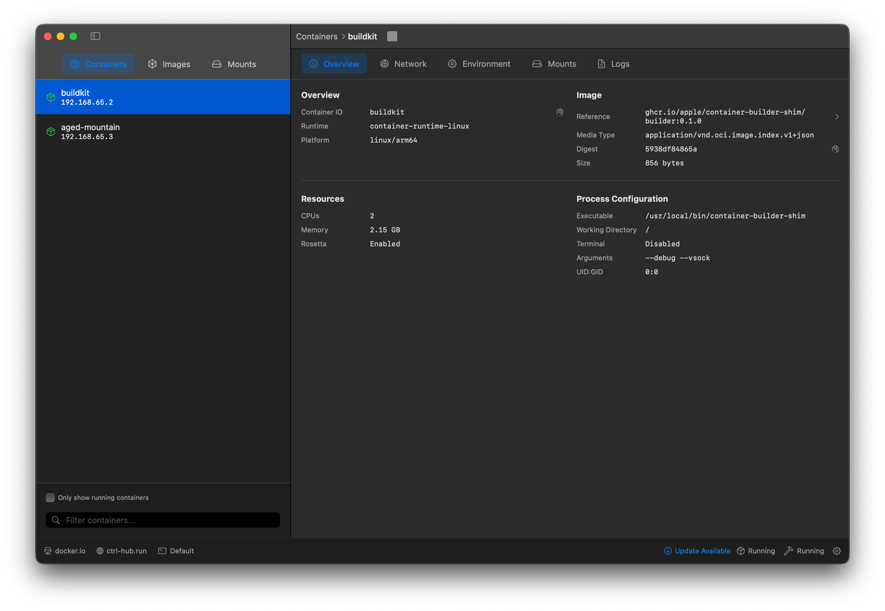
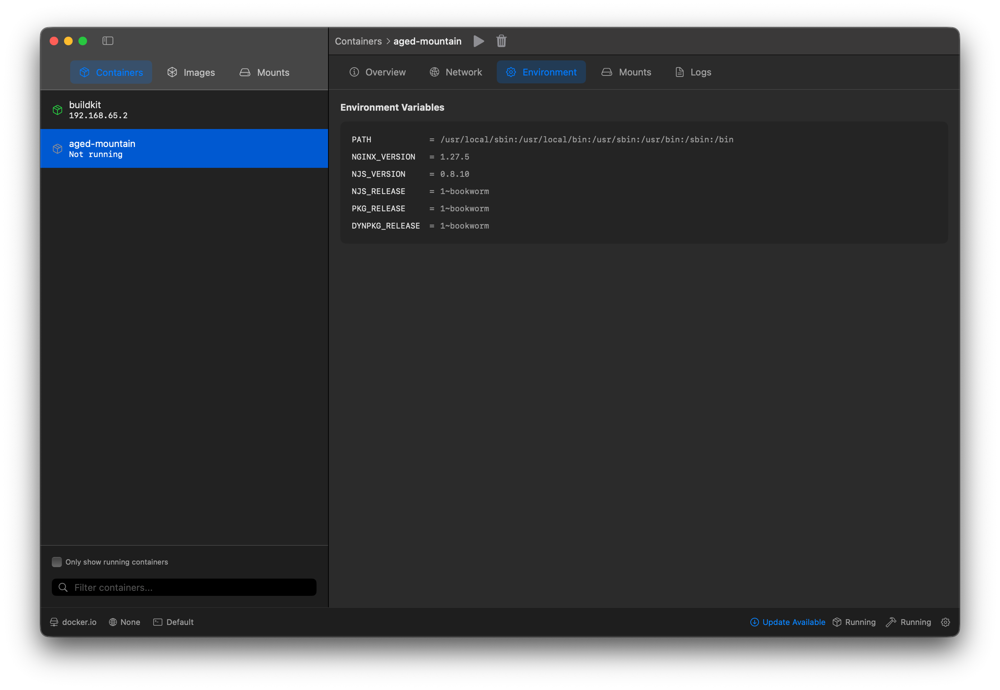
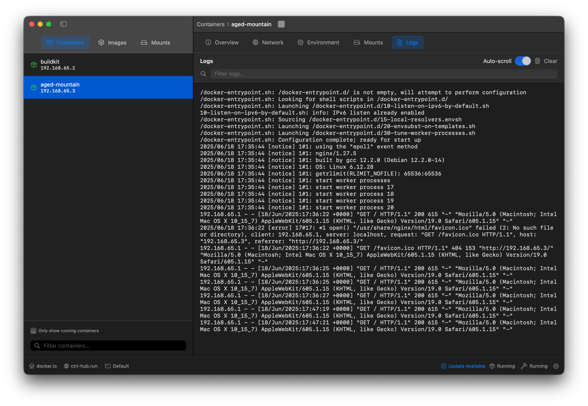
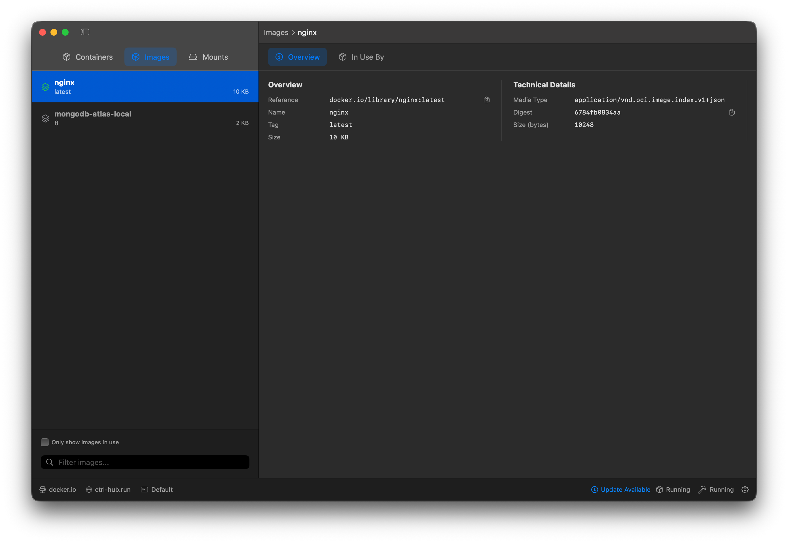
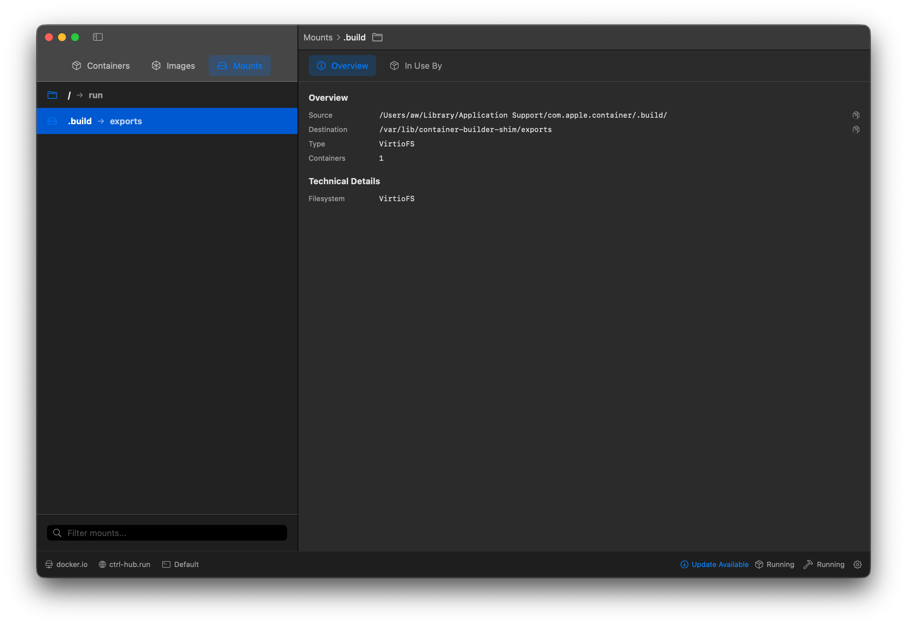
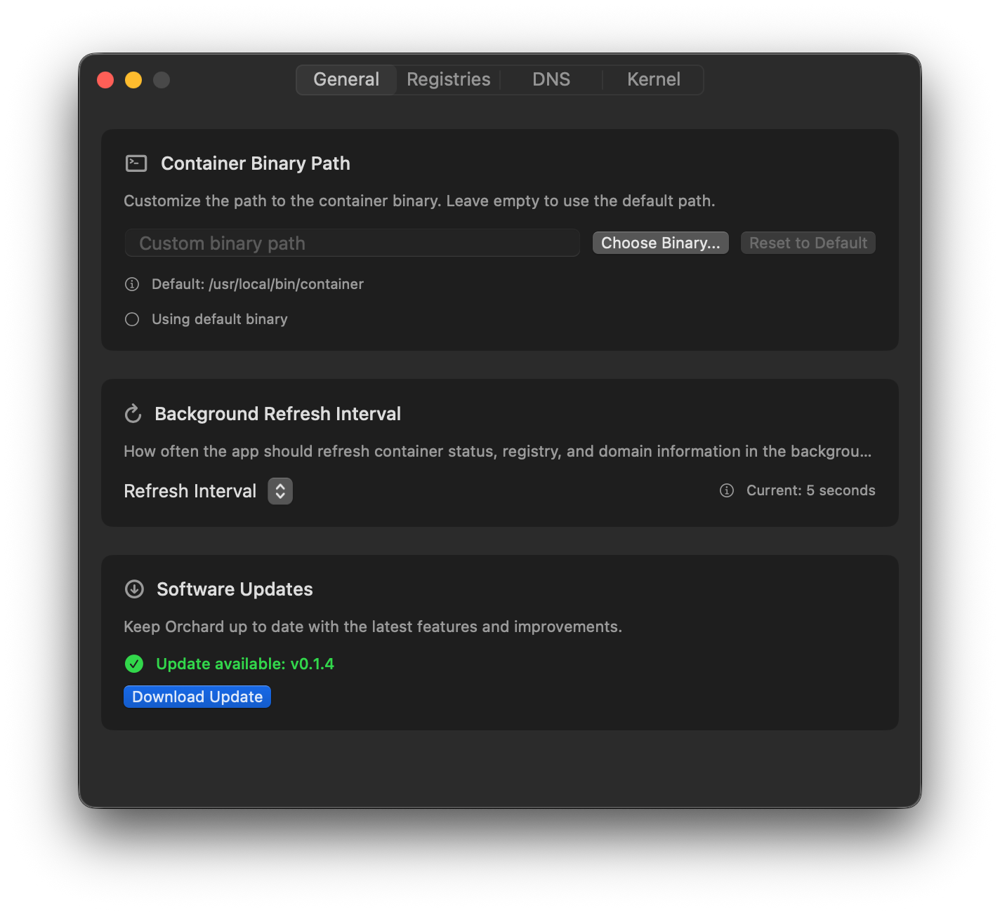
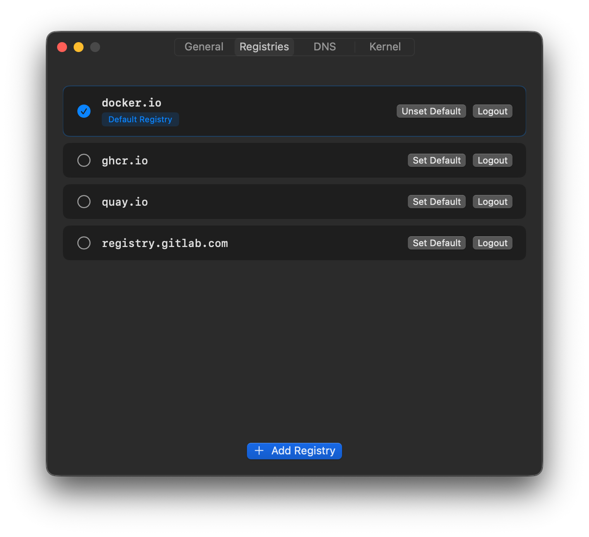
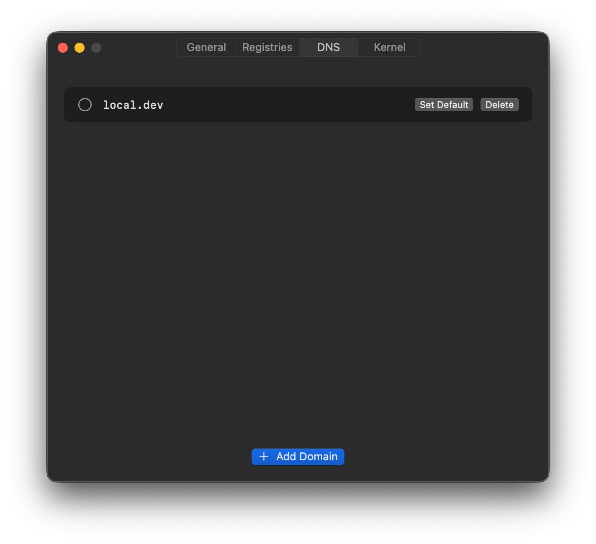
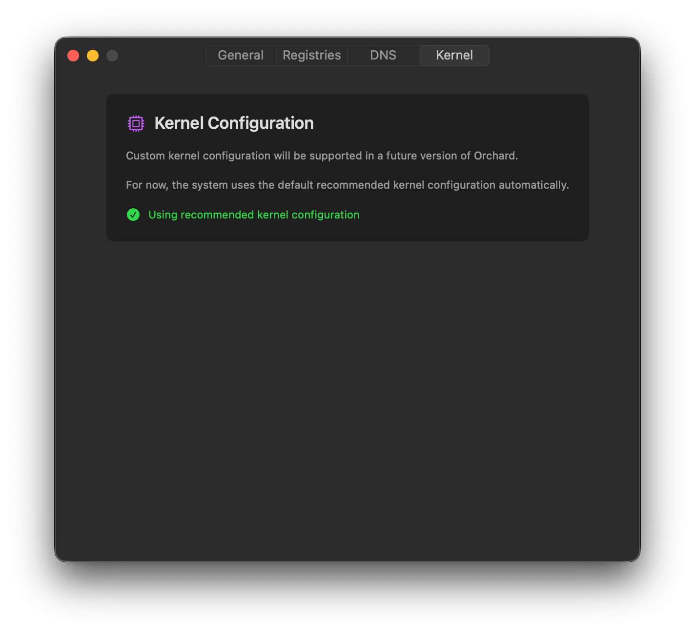

# Orchard

Orchard is a native (swift) application to manage containers on macOS using the new [Containerization framework](https://github.com/apple/containerization).

It has been based on years of experience with Docker Desktop, but dedicated to the new containerization option.

The ambition of the project is to allow it easy for developers to switch from Docker Desktop to Containers. Orchard gives you a desktop experience that complements the (`container ...`) command-line interface.



In addition, there is a companion side project ([cli](https://github.com/container-compose/cli) which aims to provide the same ergonomics as `docker compose` that interacts with containers and can use your existing docker compose files.

Both projects are new - the tech has only been available for a week! So there is a lot more to do to make this useful. Feedback is naturally welcome.

## Highlight of Containerization

- Made by Apple: Native support, incredible performance and the engineering resources to make it work.
- Sub second startup times
- Kernel isolation by design
- Easier networking - no more port mapping (every container gets its own IP address), networks out of the box

## Requirements

> `container` relies on the new features and enhancements present in the macOS 26 beta. You can run the tool on macOS 15, but the container maintainers typically will not address issues discovered on macOS 15 that cannot be reproduced on the macOS 26 beta.

https://github.com/apple/container?tab=readme-ov-file#requirements

## Installation

You can build from source or download a prebuilt package.

### Prebuilt

1. Download the latest release from [GitHub Releases](https://github.com/container-compose/orchard/releases)
2. Open the `.dmg` file and drag Orchard to your Applications folder
3. Launch Orchard - you may need to go to **System Settings > Privacy & Security** and click "Open Anyway" to allow the app to run

### Build from Source

```bash
git clone https://github.com/container-compose/orchard.git
cd orchard
open Orchard.xcodeproj
```

Build and run using Xcode 15.0 or later.

## Screenshots











